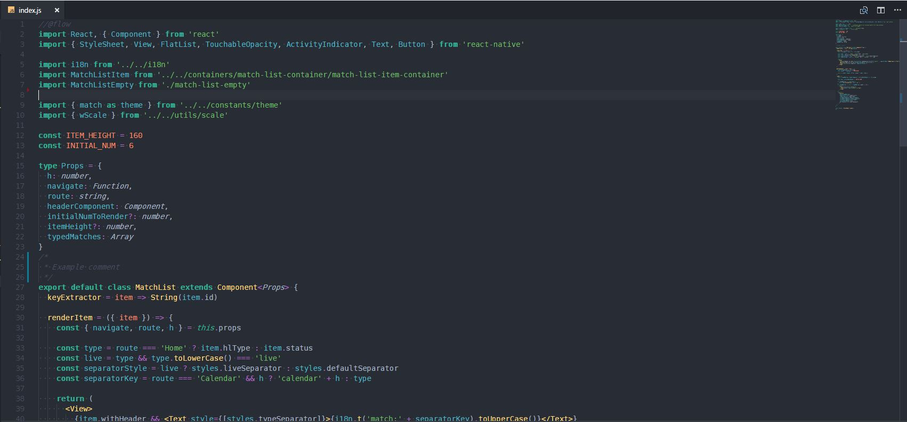
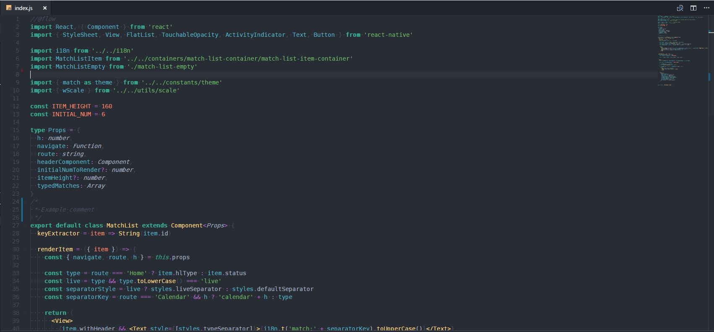

# Early Morning Theme for VSCode

This is my personal theme, from Material, with some specific JavaScript edits.
Two themes are bundled: Earl Morning & Early Morning Hangover.
The second one is variant with low contrast characters (braces, commas... check the screenshots below).

# Getting started

You will soon be able to install this theme through the [Visual Studio Code Marketplace](https://marketplace.visualstudio.com/).

## Installation

##### GitHub Repository Clone

Change to your `.vscode/extensions` [VS Code extensions directory](https://code.visualstudio.com/docs/extensions/install-extension#_side-loading).
Depending on your platform it is located in the following folders:

*  **Linux** `~/.vscode/extensions`
*  **macOs** `~/.vscode/extensions`
*  **Windows** `%USERPROFILE%\.vscode\extensions`

```shell
git clone https://github.com/gijosso/early-morning-vscode-theme
```

## Activate theme

Launch _Quick Open_,

*  <a href="https://code.visualstudio.com/shortcuts/keyboard-shortcuts-linux.pdf">Linux</a> `Ctrl + Shift + P`
*  <a href="https://code.visualstudio.com/shortcuts/keyboard-shortcuts-macos.pdf">macOS</a> `⌘ + Shift + P`
*  <a href="https://code.visualstudio.com/shortcuts/keyboard-shortcuts-windows.pdf">Windows</a> `Ctrl + Shift + P`

Type `theme` and choose `Preferences: Color Theme`, then select one of the Early Morning variant from the list. After the activation the theme will set the correct icons theme for you, based on your picked theme variant.

## Screenshot




